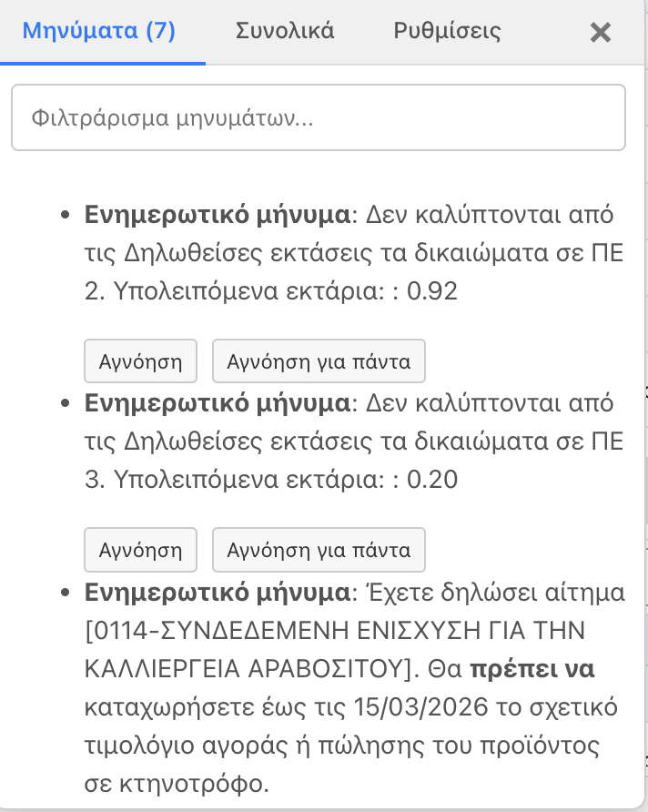
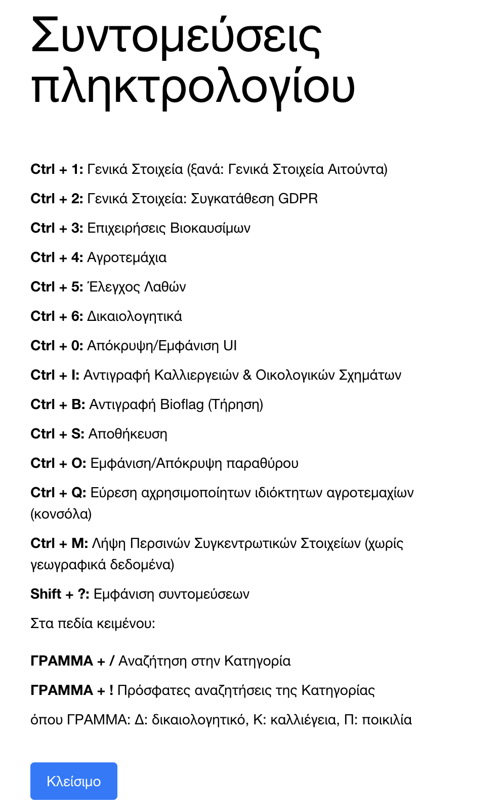

# ΟΣΔΕ HELPER 🇬🇷

Μια επέκταση περιηγητή (browser extension) για την αναβάθμιση της εμπειρίας στην πύλη του ΟΠΕΚΕΠΕ (ΕΑΕ 2024). Αυτό το εργαλείο είναι σχεδιασμένο για αγρότες, συμβούλους, και οποιονδήποτε παλεύει με την ιστοσελίδα του ΟΠΕΚΕΠΕ, με στόχο να αυτοματοποιήσει επαναλαμβανόμενες εργασίες, να απλοποιήσει την εισαγωγή δεδομένων και να κάνει τη ζωή σας ευκολότερη.

## ✨ Βασικά Χαρακτηριστικά

*   **🤖 Αυτοματοποιημένη Λήψη Μηνυμάτων:** Παρακολουθεί για εσάς τα μηνύματα και τα σφάλματα του συστήματος, εμφανίζοντάς τα σε ένα καθαρό περιβάλλον με δυνατότητες φιλτραρίσματος.

    

*   **🔍 Έξυπνη Αναζήτηση Εντός Σελίδας:** Αναζητήστε άμεσα καλλιέργειες, ποικιλίες και άλλα, απευθείας από οποιοδήποτε πεδίο εισαγωγής. Δεν χρειάζεται πλέον να πλοηγείστε αλλού για να βρείτε αυτό που χρειάζεστε.

*   **⚡️ Ισχυρά Εργαλεία Δεδομένων:** Χρησιμοποιήστε συντομεύσεις πληκτρολογίου για να εκτελέσετε σύνθετες ενέργειες σε δευτερόλεπτα:
    *   Αντιγραφή δεδομένων (καλλιέργειες, eco-schemes, βιολογική κατάσταση) μεταξύ αγροτεμαχίων.
    *   Μαζική ενημέρωση στοιχείων ιδιοκτησίας από ένα απλό αρχείο JSON.
    *   Γρήγορη εύρεση αχρησιμοποίητων αγροτεμαχίων.
    *   Δημιουργία νέας αίτησης με προ-συμπληρωμένα δεδομένα.

*   **📌 Επίμονη Διεπαφή Χρήστη (Persistent UI):** Ένα εύχρηστο, μετακινούμενο παράθυρο (pop-up) σας δίνει πρόσβαση σε όλες τις λειτουργίες χωρίς να εμποδίζει.

*   **🔄 Αξιόπιστη Διαχείριση Κατάστασης (State Management):** Διασφαλίζει ότι τα δεδομένα σας είναι πάντα συγχρονισμένα σε ολόκληρη την επέκταση.

## 🔧 Εγκατάσταση

Μπορείτε να εγκαταστήσετε την τελευταία έκδοση της επέκτασης ακολουθώντας τα παρακάτω βήματα:

1.  **Κατεβάστε την Έκδοση:** Πηγαίνετε στη [σελίδα των Releases](https://github.com/angelospk/enosi-ext/releases) και κατεβάστε το αρχείο `.zip` για τον browser σας (π.χ., `chrome-v1.0.0.zip`).
2.  **Αποσυμπιέστε το αρχείο:** Αποσυμπιέστε το `.zip` σε έναν φάκελο στον υπολογιστή σας.
3.  **Φορτώστε την Επέκταση:**
    *   **Στον Chrome:**
        1.  Πηγαίνετε στο `chrome://extensions`.
        2.  Ενεργοποιήστε τη "Λειτουργία προγραμματιστή" (Developer mode).
        3.  Πατήστε "Φόρτωση αποσυμπιεσμένης" (Load unpacked) και επιλέξτε τον φάκελο που δημιουργήσατε στο προηγούμενο βήμα.
    *   **Στον Firefox:**
        1.  Πηγαίνετε στο `about:debugging#/runtime/this-firefox`.
        2.  Πατήστε "Load Temporary Add-on..." και επιλέξτε το αρχείο `manifest.json` μέσα στον φάκελο που δημιουργήσατε.

## 🚀 Supercharged Συντομεύσεις

Απελευθερώστε την πλήρη ισχύ της επέκτασης με αυτές τις συντομεύσεις πληκτρολογίου:

| Συντόμευση   | Ενέργεια                                                                                                |
| ------------- | ------------------------------------------------------------------------------------------------------- |
| `Ctrl + I`    | **Αντιγραφή Δεδομένων Αγροτεμαχίου:** Αντιγράφει δεδομένα καλλιέργειας και eco-scheme από ένα τεμάχιο σε άλλα. |
| `Ctrl + M`    | **Μαζική Ενημέρωση Πληροφοριών:** Ρυθμίζει τις γενικές πληροφορίες μιας αίτησης (ενισχύσεις, έγγραφα, κ.λπ.) από αρχείο JSON. |
| `Ctrl + E`    | **Ανανέωση Ιδιοκτησίας:** Μαζική ενημέρωση, δημιουργία ή διαγραφή εγγραφών ιδιοκτησίας από αρχείο JSON.       |
| `Ctrl + Q`    | **Εύρεση Αχρησιμοποίητων Τεμαχίων:** Βρίσκει και καταγράφει αγροτεμάχια από το ΑΑΔΕ που δεν υπάρχουν στην τρέχουσα αίτηση. |
| `Ctrl + 1..9` | **Γρήγορη Πλοήγηση:** Άμεση μετάβαση σε διαφορετικές καρτέλες της αίτησης ΟΠΕΚΕΠΕ.                      |

## 🛠️ Τεχνολογίες

Η επέκταση είναι χτισμένη με σύγχρονες τεχνολογίες web:

*   **Frontend:** [Vue.js](https://vuejs.org/)
*   **State Management:** [Pinia](https://pinia.vuejs.org/)
*   **Browser APIs:** [WebExtensions](https://developer.mozilla.org/en-US/docs/Mozilla/Add-on_SDK/API/webextension)
*   **Επικοινωνία:** `webext-bridge`

Η επέκταση αποτελείται από ένα background script για την κεντρική λογική και την επικοινωνία, και ένα content script που εισάγει το UI και τις νέες λειτουργίες απευθείας στην ιστοσελίδα του ΟΠΕΚΕΠΕ.

## 🤝 Συνεισφορά

Έχετε κάποια ιδέα για μια νέα λειτουργία ή βρήκατε κάποιο σφάλμα; Θα θέλαμε τη βοήθειά σας! Μη διστάσετε να [ανοίξετε ένα issue](https://github.com/angelospk/enosi-ext/issues) για να ξεκινήσουμε μια συζήτηση.

## 📄 Άδεια Χρήσης

Το project διανέμεται υπό την άδεια MIT. Δείτε το αρχείο [LICENSE](LICENSE) για λεπτομέρειες.
