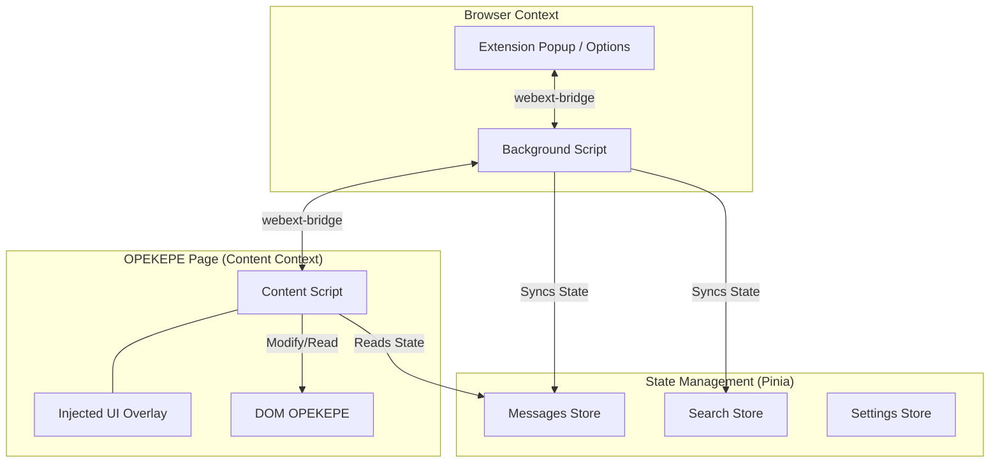

# ΟΣΔΕ HELPER 🇬🇷

[](https://opensource.org/licenses/MIT)
[](https://vuejs.org/)
[](https://vitejs.dev/)
[](https://www.typescriptlang.org/)

Μια προηγμένη επέκταση περιηγητή (browser extension) σχεδιασμένη αποκλειστικά για την πλατφόρμα του ΟΠΕΚΕΠΕ (ΕΑΕ 2024). Το **ΟΣΔΕ Helper** λειτουργεί ως ο προσωπικός σας βοηθός, αυτοματοποιώντας διαδικασίες, βελτιώνοντας την αναζήτηση και προσφέροντας εργαλεία που λείπουν από την επίσημη εφαρμογή.

---

## 🏗️ Αρχιτεκτονική Συστήματος

Η επέκταση βασίζεται σε μια μοντέρνα αρχιτεκτονική WebExtension, χρησιμοποιώντας το **Vue 3** για το UI και το **Pinia** για τη διαχείριση της κατάστασης (state management). Η επικοινωνία μεταξύ των διαφορετικών μερών της επέκτασης (Background, Content Script, Popup) γίνεται μέσω του `webext-bridge`, εξασφαλίζοντας ότι τα δεδομένα σας είναι πάντα συγχρονισμένα.


```mermaid
graph TD
    subgraph Browser Context
        UI[Extension Popup / Options]
        BG[Background Script]
    end

    subgraph "OPEKEPE Page (Content Context)"
        CS[Content Script]
        Overlay[Injected UI Overlay]
        DOM[DOM OPEKEPE]
    end

    %% Communications
    UI <-->|"webext-bridge"| BG
    BG <-->|"webext-bridge"| CS
    CS -->|"Modify/Read"| DOM
    CS --- Overlay

    %% State Management
    subgraph "State Management (Pinia)"
        StoreMsg[Messages Store]
        StoreSearch[Search Store]
        StoreSettings[Settings Store]
    end

    BG -- "Syncs State" --> StoreMsg
    BG -- "Syncs State" --> StoreSearch
    CS -- "Reads State" --> StoreMsg
```

*   **Background Script:** Ο "εγκέφαλος" της επέκτασης. Εκτελείται στο παρασκήνιο, διαχειρίζεται τη συνεδρία, ανιχνεύει αλλαγές και συγχρονίζει τα δεδομένα.
*   **Content Script:** Ο "πράκτορας" που ζει μέσα στη σελίδα του ΟΠΕΚΕΠΕ. Εισάγει το UI (κουμπιά, παράθυρα) και αλληλεπιδρά απευθείας με τη φόρμα της αίτησης.
*   **State Management:** Όλα τα δεδομένα (μηνύματα λαθών, ρυθμίσεις, αποτελέσματα αναζήτησης) μοιράζονται αυτόματα μεταξύ όλων των παραθύρων.

---

## ✨ Αναλυτικά Χαρακτηριστικά

### 1. 🔍 Έξυπνη Αναζήτηση (Smart Search)
Ξεχάστε την αργή αναζήτηση της εφαρμογής.
*   **Άμεση εύρεση:** Πληκτρολογήστε σε οποιοδήποτε πεδίο (Καλλιέργεια, Ποικιλία, κ.λπ.) και δείτε αποτελέσματα ακαριαία.
*   **Pre-fetched Data:** Η επέκταση φορτώνει εκ των προτέρων τους καταλόγους του ΟΠΕΚΕΠΕ για μηδενική καθυστέρηση.

### 2. ⚡️ Μαζικές Ενέργειες (Automation)
Εργαλεία που μειώνουν τα κλικ κατά 90%.
*   **Αντιγραφή Δεδομένων (`Ctrl + I`):** Αντιγράψτε τα στοιχεία μιας καλλιέργειας (Είδος, Ποικιλία, Eco-schemes) και επικολλήστε τα μαζικά σε άλλα αγροτεμάχια.
*   **JSON Import/Export:** Εξάγετε ή εισάγετε δεδομένα ιδιοκτησίας και ενοικιαστηρίων μέσω αρχείων JSON.
*   **Έλεγχος Αχρησιμοποίητων (`Ctrl + Q`):** Συγκρίνει τα αγροτεμάχια του ΑΑΔΕ με αυτά της αίτησης και σας δείχνει ποια ξεχάσατε.

### 3. 🛡️ Διαχείριση Σφαλμάτων
Ένα κεντρικό κέντρο ελέγχου για όλα τα μηνύματα του συστήματος.
*   **Κατηγοριοποίηση:** Διαχωρίζει αυτόματα τα "Λάθη", τις "Προειδοποιήσεις" και τις "Πληροφορίες".
*   **Ιστορικό:** Κρατάει ιστορικό των μηνυμάτων ώστε να μην χάνετε τίποτα, ακόμη κι αν κλείσει το popup του ΟΠΕΚΕΠΕ.
*   **Φιλτράρισμα:** Δείτε μόνο ό,τι σας ενδιαφέρει (π.χ. μόνο τα Κρίσιμα Λάθη).

---

## 🚀 Εγκατάσταση & Χρήση

### Για Απλούς Χρήστες

1.  Μεταβείτε στη σελίδα [Releases](https://github.com/angelospk/enosi-ext/releases) (αν υπάρχει) ή ζητήστε το αρχείο `.zip`.
2.  Αποσυμπιέστε το αρχείο.
3.  Ανοίξτε τον Chrome και πηγαίνετε στο `chrome://extensions`.
4.  Ενεργοποιήστε το **Developer mode** (πάνω δεξιά).
5.  Πατήστε **Load unpacked** και επιλέξτε τον φάκελο της επέκτασης.

### Συντομεύσεις Πληκτρολογίου

| Συντόμευση | Λειτουργία | Περιγραφή |
| :--- | :--- | :--- |
| `Ctrl + I` | **Αντιγραφή** | Αντιγραφή στοιχείων από το επιλεγμένο τεμάχιο σε άλλα. |
| `Ctrl + M` | **Μαζική Ενημέρωση** | Ενημέρωση γενικών στοιχείων αίτησης από JSON. |
| `Ctrl + E` | **Ιδιοκτησία** | Ενημέρωση στοιχείων ιδιοκτησίας από JSON. |
| `Ctrl + Q` | **Αχρησιμοποίητα** | Εύρεση τεμαχίων ΑΑΔΕ που λείπουν από την αίτηση. |
| `Ctrl + 1-9` | **Πλοήγηση** | Γρήγορη μετάβαση στις καρτέλες της αίτησης. |

---

## 👨‍💻 Οδηγός Ανάπτυξης (Development)

Αν είστε προγραμματιστής και θέλετε να συνεισφέρετε ή να πειράξετε τον κώδικα:

### Προαπαιτούμενα
*   [Node.js](https://nodejs.org/) (v18+)
*   [pnpm](https://pnpm.io/) (συνιστάται) ή npm

### Ρύθμιση Περιβάλλοντος

1.  **Κλωνοποίηση του repo:**
    ```bash
    git clone https://github.com/angelospk/enosi-ext.git
    cd enosi-ext
    ```

2.  **Εγκατάσταση εξαρτήσεων:**
    ```bash
    pnpm install
    ```

3.  **Εκκίνηση σε Development Mode:**
    Αυτό θα ξεκινήσει τον Vite server και θα κάνει watch για αλλαγές.
    ```bash
    pnpm dev
    # ή για συγκεκριμένο browser
    pnpm dev:chrome
    pnpm dev:firefox
    ```

4.  **Φόρτωση στον Browser:**
    *   Στον Chrome, φορτώστε τον φάκελο `dist/chrome`.
    *   Κάθε φορά που κάνετε αλλαγή στον κώδικα, ο Vite θα κάνει HMR (Hot Module Replacement) ή reload αυτόματα.

### Build για Production

Για να δημιουργήσετε τα τελικά αρχεία προς διανομή:

```bash
pnpm build
```
Τα αρχεία θα δημιουργηθούν στους φακέλους `dist/chrome` και `dist/firefox`.

---

## 📂 Δομή Φακέλων

```
src/
├── background/      # Κώδικας που τρέχει στο παρασκήνιο (Service Workers)
├── content-script/  # Κώδικας που εισάγεται στη σελίδα (DOM manipulation)
├── ui/              # Vue components για τα διάφορα UI μέρη
│   ├── action-popup/       # Το popup πατώντας το εικονίδιο
│   ├── content-script-iframe/ # Το UI που εμφανίζεται μέσα στη σελίδα
│   └── options-page/       # Σελίδα ρυθμίσεων
├── stores/          # Pinia stores (διαχείριση κατάστασης)
├── components/      # Κοινόχρηστα Vue components
└── utils/           # Βοηθητικές συναρτήσεις
```

---

## 🛠️ Τεχνολογίες

*   **Framework:** [Vue 3](https://vuejs.org/) (Composition API)
*   **Build Tool:** [Vite](https://vitejs.dev/)
*   **Extension Plugin:** [CRXJS Vite Plugin](https://crxjs.dev/vite-plugin)
*   **State Management:** [Pinia](https://pinia.vuejs.org/)
*   **UI Library:** [Nuxt UI](https://ui.nuxt.com/) / Tailwind CSS
*   **Messaging:** [webext-bridge](https://github.com/zikaari/webext-bridge)

## 🤝 Συνεισφορά

Οι συνεισφορές είναι ευπρόσδεκτες! Παρακαλώ ακολουθήστε τα εξής βήματα:
1.  Κάντε Fork το project.
2.  Δημιουργήστε ένα νέο Branch (`git checkout -b feature/AmazingFeature`).
3.  Κάντε Commit τις αλλαγές σας (`git commit -m 'Add some AmazingFeature'`).
4.  Κάντε Push στο Branch (`git push origin feature/AmazingFeature`).
5.  Ανοίξτε ένα Pull Request.

## 📄 Άδεια

Διανέμεται υπό την άδεια MIT. Δείτε το αρχείο `LICENSE` για περισσότερες πληροφορίες.
